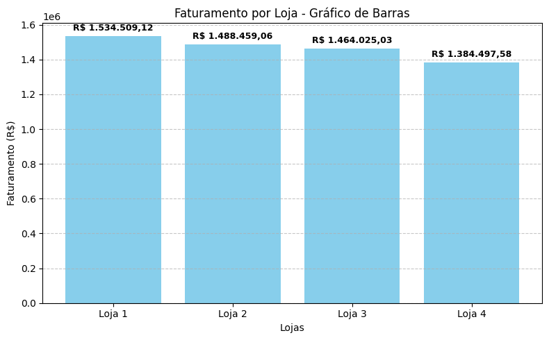
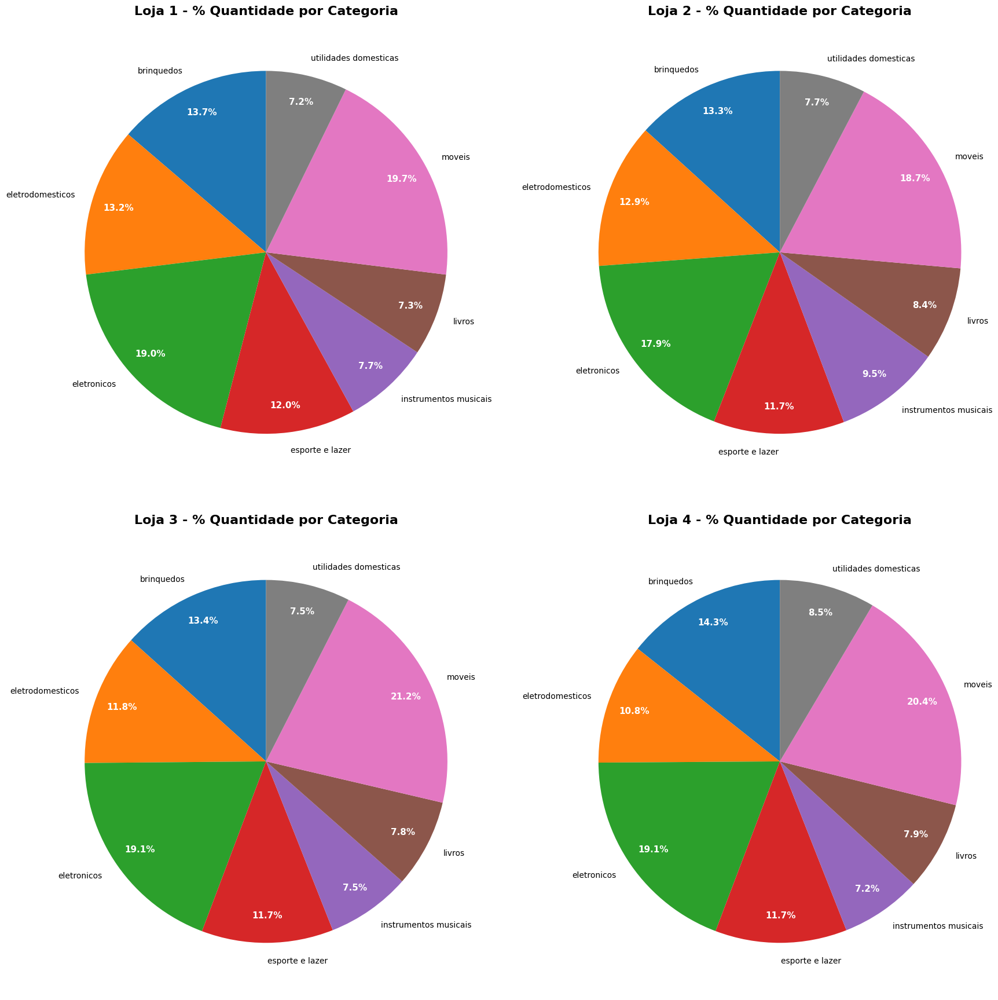
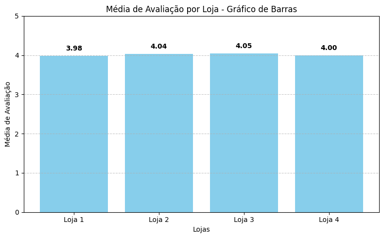
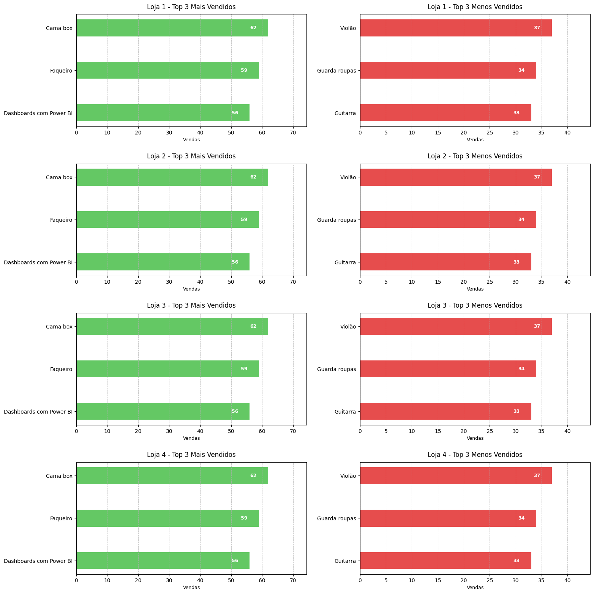
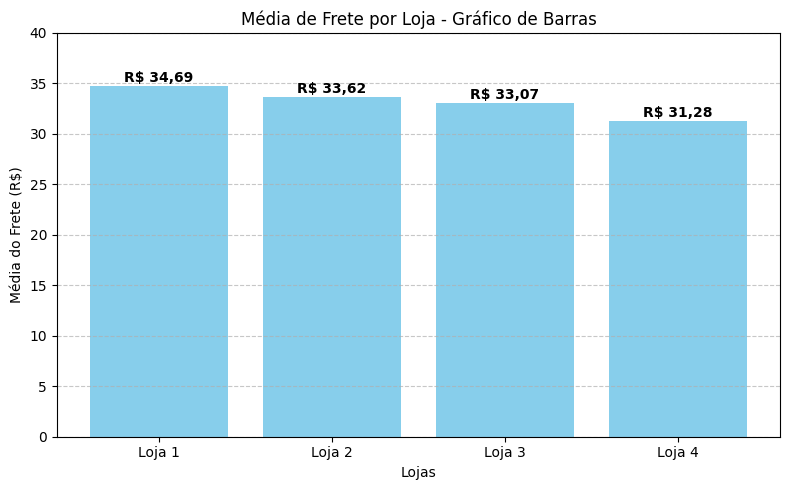

# 🛒 Análise de Desempenho das Lojas - AluraStoreBR

Este projeto realiza uma análise comparativa entre quatro lojas virtuais da AluraStore, com base nos dados de vendas, frete, avaliação dos clientes e categorias de produtos.

## 📊 1. Faturamento por Loja

Análise do total de faturamento de cada loja, considerando todos os pedidos realizados.

---

## 📦 2. Distribuição de Vendas por Categoria

Proporção de vendas por tipo de produto em cada loja:

---

## 🌟 3. Média de Avaliação por Loja

Avaliando a satisfação dos clientes com as compras realizadas:

---

## 🌟 4. Top 3 Produtos Mais e Menos Vendidos

Relação dos produtos mais e menos vendidos por loja:

---

## 🚚 5. Frete Médio por Loja

Comparação do valor médio de frete cobrado por loja:

---

## 📝 Relatório Final

- **Faturamento total**: Loja 4 teve o pior faturamento, com R$ 79.527,45 a menos que a loja 3.
- **Categorias**: A categoria de **móveis** lidera as vendas em todas as lojas.
- **Avaliação média**: Loja 4 teve a **2ª pior média**, com nota 4.
- **Frete**: Embora a loja 4 tenha o menor frete, isso **não refletiu** em melhores resultados de vendas ou avaliações.

---

## ✅ Conclusão

A **Loja 4** apresentou o pior desempenho em dois critérios fundamentais: faturamento e avaliação. Portanto, recomendou-se a sua venda.

---

## 🚀 Como Executar

Você pode executar este projeto no Google Colab ou Jupyter Notebook. Os dados estão disponíveis nos seguintes links:
- [Loja 1](https://raw.githubusercontent.com/alura-es-cursos/challenge1-data-science/refs/heads/main/base-de-dados-challenge-1/loja_1.csv)
- [Loja 2](https://raw.githubusercontent.com/alura-es-cursos/challenge1-data-science/refs/heads/main/base-de-dados-challenge-1/loja_2.csv)
- [Loja 3](https://raw.githubusercontent.com/alura-es-cursos/challenge1-data-science/refs/heads/main/base-de-dados-challenge-1/loja_3.csv)
- [Loja 4](https://raw.githubusercontent.com/alura-es-cursos/challenge1-data-science/refs/heads/main/base-de-dados-challenge-1/loja_4.csv)

---

## 📁 Estrutura

📦 AluraStoreBR

┣ 📊 imagens/

┃ ┣ faturamento.png

┃ ┣ vendasCategoria.png

┃ ┣ maisMenosVendidos.png

┃ ┣ avaliacao.png

┃ ┗ frete_medio.png

┣ 📜 AluraStoreBr.ipynb

┗ 📄 README.md

--- 

Feito com 💙 para o desafio de Data Science da Alura.

